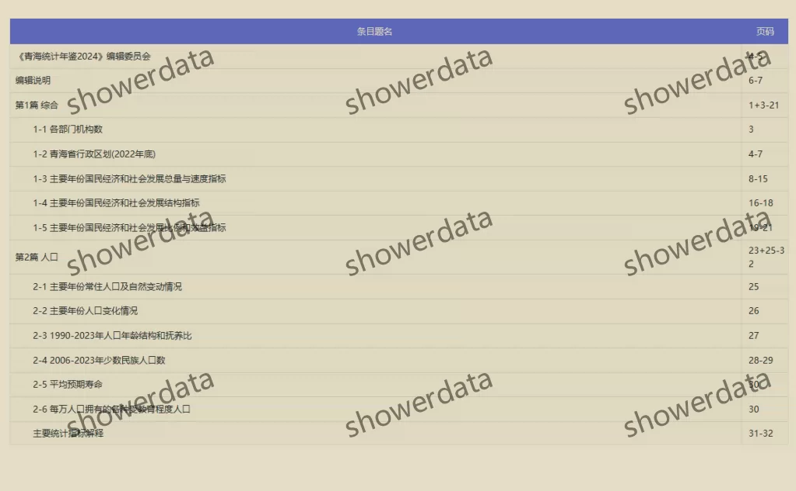
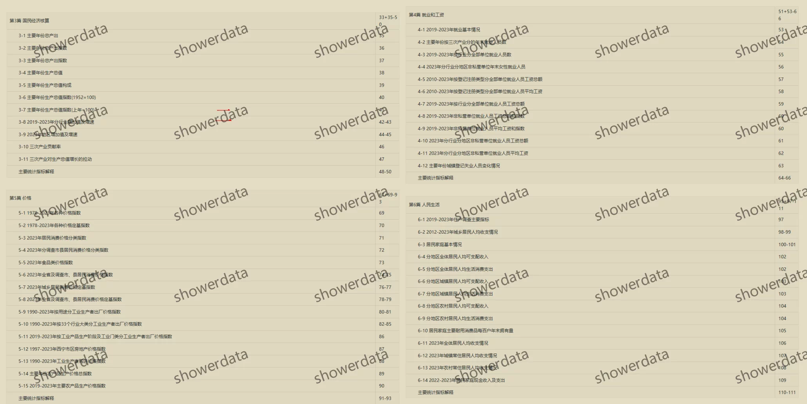
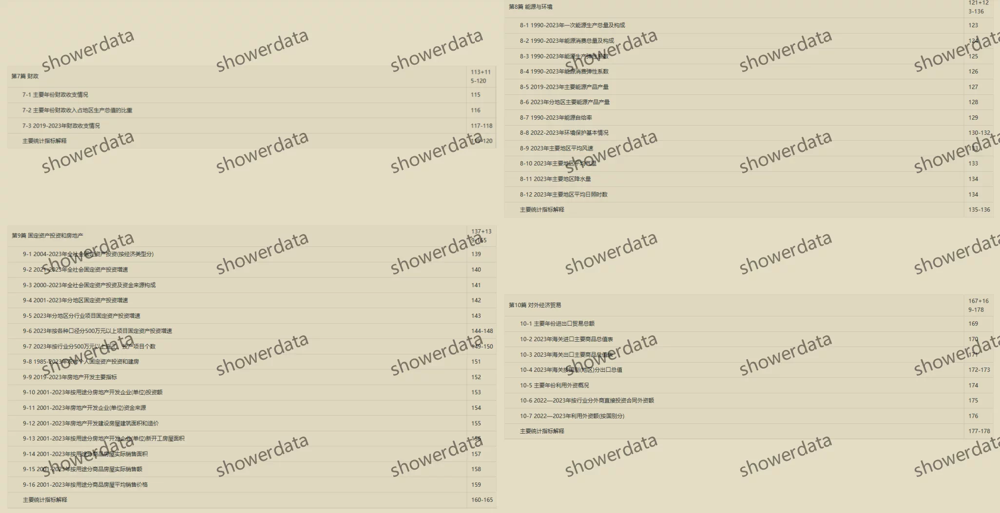
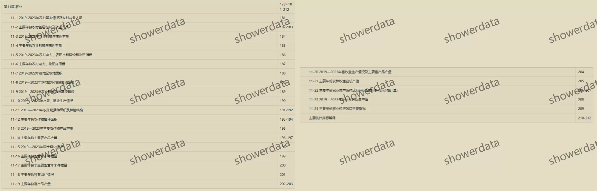
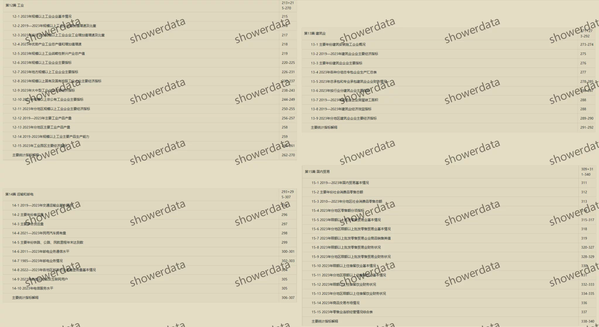
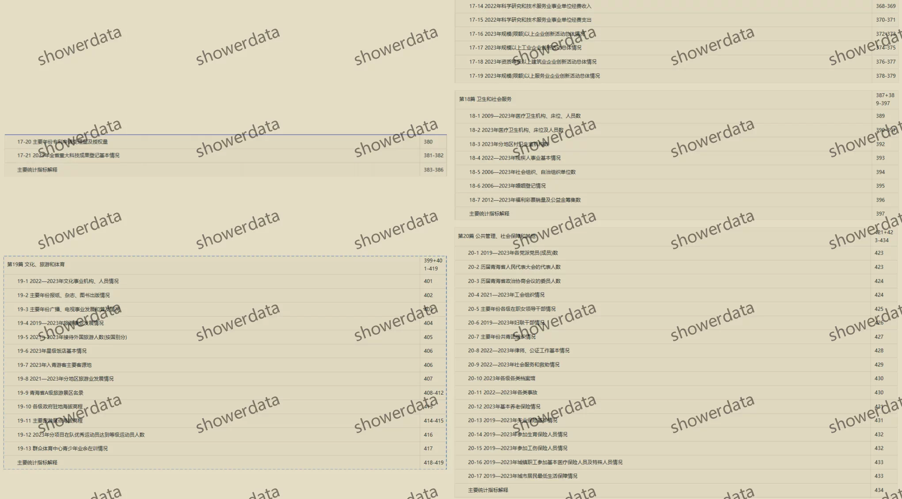
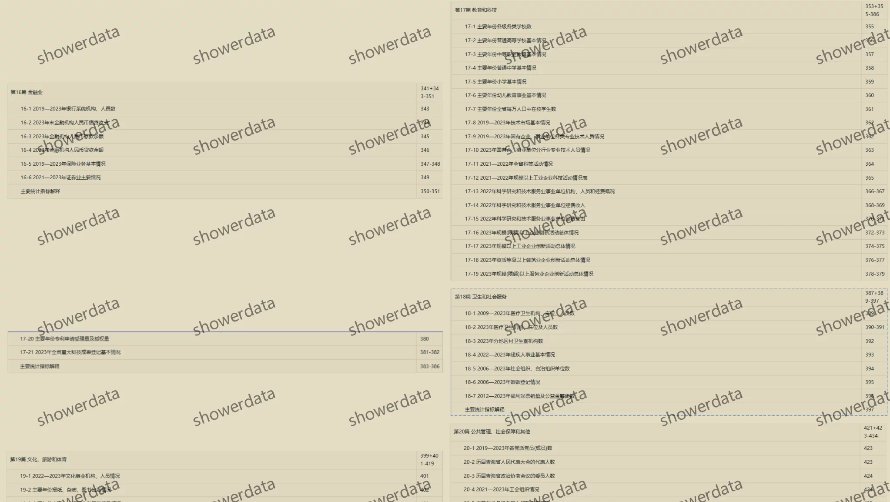

## Body

《Qinghai Statistical Yearbook》（1985-2025）

Data Year: The title year is the year of data compilation, and the data year needs to be one less than the title year.
Please check the image below before purchasing! The complete display is provided here, please confirm if it's what you need before purchasing! No returns or exchanges after shipping!

01. Data Introduction
The Qinghai Statistical Yearbook

02. Indicator Details
(1) The directory is displayed in the image, please take a look on your own, consider buying according to your needs, we do not help you find data, all information is here, after shipping, there are no reasons for return or exchange.
(2) The display directory is for 2024, due to limited space, only some parts are shown, the statistical口径 may change from year to year. Academic common sense, the data year recorded in statistical materials is the previous year's data, which is also an academic common sense, hope everyone understands.
(3) The EXCEL format data is organized from original materials, including the content of the original material data, without the text content of the original material.
(4) If the data is placed in a zip package, you need to save the zip package first, then download, then unzip.
(5) If there is Excel protection, you can select all and copy to a new sheet to use.

03. Data Content
Pdf and Excel versions available, only CD-ROM version for 2025.

## Images

item_1068999062416

Here is a pay link on Stripe ( https://buy.stripe.com/3cs8yP7sY87d0vu9AB ). Please contact me lonlonago@foxmail.com after funding $89, and I will send you a complete data files , thank you!

